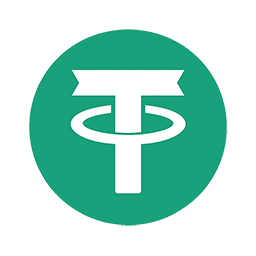

  

# TechneoUSDT

**TechneoUSDT** is a dual-chain stablecoin deployed on both the **TRON (TRC-20)** and **BNB Smart Chain (BEP-20)** networks. Backed by real liquidity and designed for fast, low-cost digital transactions, TechneoUSDT is built for transparency, scalability, and investor confidence.

---

## 🔗 Key Links

- 🌐 [TRONSCAN Token Page](https://tronscan.org/#/token20/TBm9y34PWdacMNvgzqFoevBpScJ9pSp8nc)  
- 🌐 [BscScan Token Page](https://bscscan.com/token/0xb4EE8Df4C2EA3c262B13F8c44F6300338B8579e6)  
- 📜 [TRON Smart Contract](./tron-usdt/TechneoUSDT.sol)  
- 📜 [BNB Smart Contract](./bnb-usdt/TechneoUSDT.sol)  
- 📣 Contact: info@techneousdt.com

---

## 📊 Token Specifications

### 🔴 TRON Network (TRC-20)

| Property         | Value                                  |
|------------------|----------------------------------------|
| **Name**         | TechneoUSDT                            |
| **Symbol**       | USDT                                   |
| **Decimals**     | 6                                      |
| **Total Supply** | 1,000,000,000,000 USDT                 |
| **Standard**     | TRC-20                                 |
| **Chain**        | TRON                                   |
| **Token Address**| TBm9y34PWdacMNvgzqFoevBpScJ9pSp8nc     |
| **Owner Address**| TFrEHsnyTz6tJrQfDpFdiWNwa8hR2SfqQM      |

---

### 🟡 BNB Smart Chain (BEP-20)

| Property         | Value                                  |
|------------------|----------------------------------------|
| **Name**         | TechneoUSDT                            |
| **Symbol**       | USDT                                   |
| **Decimals**     | 6                                      |
| **Total Supply** | 1,000,000,000,000 USDT                 |
| **Standard**     | BEP-20                                 |
| **Chain**        | BNB Smart Chain                        |
| **Token Address**| 0xb4EE8Df4C2EA3c262B13F8c44F6300338B8579e6 |
| **Owner Address**| 0xYourBNBOwnerAddressHere              |

---

## ⚙️ Features

- ✅ Verified TRC-20 and BEP-20 smart contracts  
- 🔒 Mint and burn logic for supply control  
- 💰 Liquidity strategy for SunSwap and PancakeSwap  
- 📈 Investor-ready roadmap and governance model  
- 🌉 Cross-chain expansion and bridge-ready architecture

---

## 🚀 Roadmap Highlights

- Launch TechneoUSDT with real liquidity  
- List on SunSwap, PancakeSwap, CoinGecko, and Trust Wallet  
- Build investor dashboard and analytics tools  
- Expand educational tools and wallet simulator  
- Maintain transparency through GitHub and whitepaper updates

---

## 📁 Repository Contents

- `tron-usdt/TechneoUSDT.sol` – TRON smart contract source  
- `bnb-usdt/TechneoUSDT.sol` – BNB smart contract source  
- `LICENSE` – MIT license for open-source use  
- `README.md` – Project overview and roadmap  
- `TechneoUSDT_Whitepaper_v1.0_Aug2025.pdf` – Whitepaper for clarity and trust  
- `techneousdt-logo.png` – Branding asset for unique identification

---

## 🤝 Contributing

Pull requests are welcome. For major changes, please open an issue first to discuss what you would like to change.

---

## 📜 License

This project is licensed under the MIT License — see the [LICENSE](./LICENSE) file for details.

---

## 📄 TechneoUSDT White Paper

Read the full white paper here:  
[TechneoUSDT_Whitepaper_v1.0_Aug2025.pdf](https://github.com/techneousdt/techneo-usdt/blob/main/TechneoUSDT_Whitepaper_v1.0_Aug2025.pdf)
